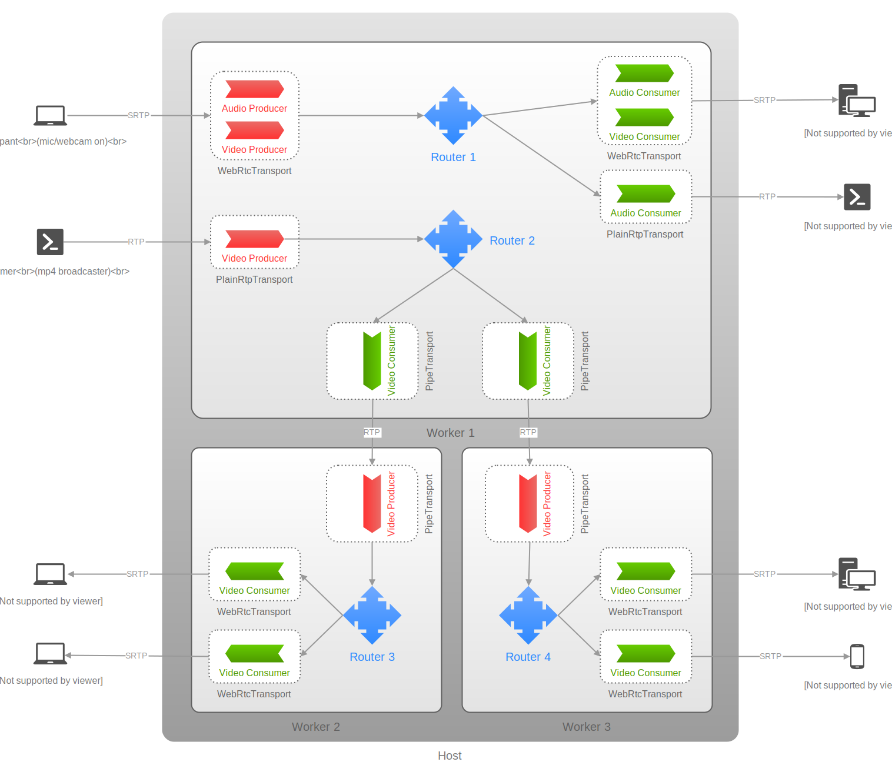

# Backend source code for StreamCall

This sourcecode is a backend service that provides video call and livestream
functionality. It is written in Typescript using NestJS and the mediasoup
library for WebRTC support.

## 🚀 Getting Started

### 🐧 For Development (Linux only)
> ⚠️ If you are using Windows run the project in WSL, or using Docker instead
> (probably still need WSL)

Our sourcecode relies on mediasoup library for WebRTC support. As mediasoup is
written in C++, it requires building the library before it can be used. Due to
the complexity of building a C++ project, Linux is the preferred development
environment over Windows.


#### ⚡ Prerequisites
To run `StreamCall`, you will need to have the following software installed on
your machine:
- Node.js (v14 or higher)
- npm (v6 or higher)
- Postgresql (v15)
- Install essential libraries for building mediasoup:
```bash
sudo apt-get update \
    && apt-get install -y net-tools build-essential python3 python3-pip valgrind
```

#### 📦 Installation
1. Clone the repository

2. Install the project dependencies:
```bash
cd stream_call-be
npm install
```

3. Create `.env` file in the root of the project set value to each variable:
```bash
cp .env.example .env
```
**Variables**:

|Name|Description|
|-|-|
|DB_USER|Username postgres|
|DB_PASSWORD|password postgres|
|DB_HOST|Host for running postgres (localhost)|
|PORT|Bind the port for application (3000)|
|DB_PORT|Bind the port for postgres (5432)|
|DB_NAME|Name of database|
|DATABASE_URL|Postgres URL to connect to your database|
|JWT_SECRET|Key for JWT encoding|
|NODE_ENV|Node environment|
|MEDIASOUP_ANNOUNCED_IP|Your public IP|

4. Run the following command to migrate your database:
> Make sure your Postgres database is up and running!
```bash
npx prisma migrate dev
```


#### 🎉 Running the app
To start the `StreamCall` server, run the following command:

```bash
npm run start:dev
```

This will start the server in development mode and listen for incoming requests
on port 3000.


### 🐬 Docker (docker and docker-compose are required)

#### Prerequisites
First you need to create volumes for storing persistent data, data like
database data, avatars and records will not be deleted even when you stop and
delete the container. Create 3 volumes by using this command:

```bash
docker volume create streamcall-db-data
docker volume create streamcall-db-images
docker volume create streamcall-db-records
```

#### 🍻 For production
You can config database, environment variables in `.env` file in `📁 deploy`
directory. If you don't care about the configs just copy `.env.example` ->
`.env` then change the `MEDIASOUP_ANNOUNCED_IP` to your IP address and you're good to go.

Navigate to the `deploy` directory and start the application with ease:
```bash
cd deploy
cp .env.example .env
docker compose up
```

#### 🚧 For development (live-reloading supported)
```bash
cd deploy
cp .env.example .env

docker compose -f docker-compose-dev.yml up
```


## 🏗️ Architecture
`StreamCall` is built using the [NestJS](https://nestjs.com/) framework, which provides a modular
architecture for building scalable and maintainable applications. The
application is divided into modules, each responsible for a specific area of
functionality.

The [mediasoup](https://mediasoup.org/) library is used for
[WebRTC](https://webrtc.org/) support, which allows for real-time communication
between clients. The server acts as a mediator between the clients and handles
the negotiation of WebRTC connections.

**Here is the image of `mediasoup` design:**

